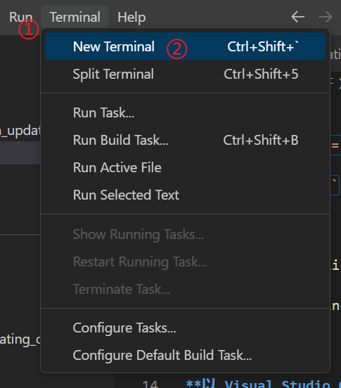
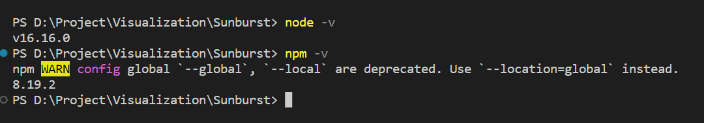
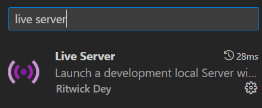
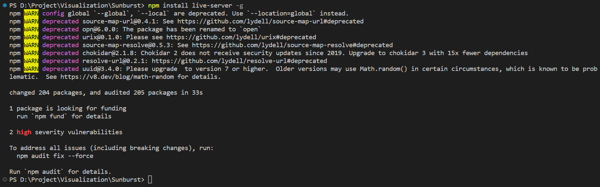
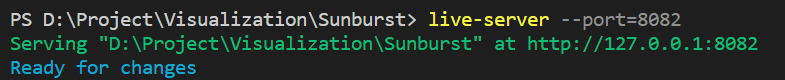
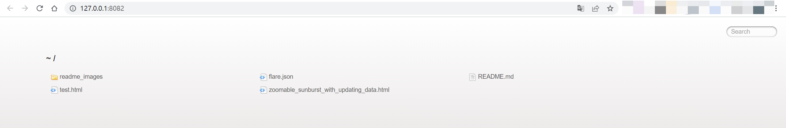

# 原项目地址

<https://gist.github.com/kerryrodden/477c1bfb081b783f80ad>

# D3版本问题

**建议使用版本 `v <= 3`**   
  
如果使用版本 `v > 3`，将文件 `zoomable_sunburst_with_updating_data.html` 做如下改变
```javascript
// 原代码
var x = d3.scale.linear()
// 修改后
var x = d3.scaleLinear()
```

# 页面打开

**以 Visual Studio Code 为例**
**不若 `Live Server` 已安装可直接跳至步骤四**

### 步骤一

在vsc内打开终端  
  


### 步骤二

检查是否安装 `node` 和 `npm`  



### 步骤三

安装 `live-server`  

#### 方法一

直接安装插件  



若安装后显示如下错误信息，则使用方法二
```  
live-server : 无法将“live-server”项识别为 cmdlet、函数、脚本文件或可运行程序的名称。请检查名称的拼写,如果包括路径,请确保路径正确,然后再试一次。
```

#### 方法二

在终端输入 `npm install liveserver -g`  



### 步骤四

在终端输入 `live-server --port=8082` 启动 `live server`  

`8082` 是端口号，可修改为任意空闲端口号



此方法启动会默认打开目录下的 `index.html` ，若目录下没有 `index.html` 文件，则可任选打开

